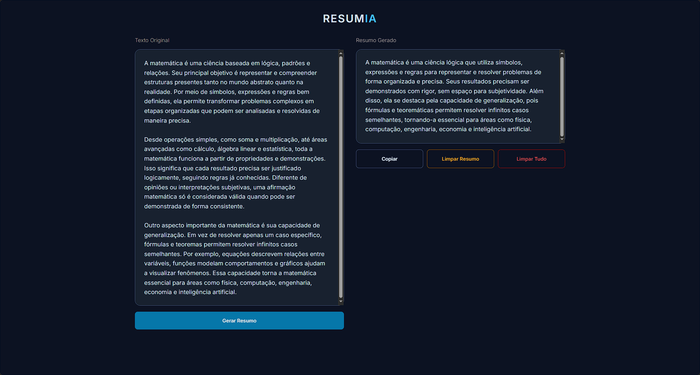

  
  # 📝 ResumIA

**Uma ferramenta inteligente e minimalista para resumir textos instantaneamente usando Inteligência Artificial.**

  

    
    
    
    
    
  

  
<strong>⚠️ Projeto Deprecado (28/05/2026):</strong> Este projeto foi descontinuado e não está mais sendo mantido. Pode não funcionar com dependências ou APIs atuais. Use por sua conta ou procure alternativas mais recentes.

 

## 📸 Interface do Projeto

  

 

## 📖 Sobre o Projeto

O **ResumIA** é uma aplicação web intuitiva focada em produtividade. Através de uma interface limpa e amigável, o usuário pode colar textos longos e, com apenas um clique, obter um resumo claro e conciso gerado por inteligência artificial.

Ideal para estudantes, profissionais e qualquer pessoa que precise otimizar seu tempo de leitura.

### ✨ Funcionalidades

- **Resumo Inteligente:** Processa textos longos e extrai os pontos principais.
- **Cópia Rápida:** Botão dedicado para copiar o resumo gerado para a área de transferência.
- **Gerenciamento Fácil:** Opções para limpar o resumo ou todo o conteúdo (texto original e resumo) rapidamente.
- **Design Responsivo:** Interface moderna (com tipografia Inter) que se adapta a diferentes tamanhos de tela.

---

## 🚀 Tecnologias Utilizadas

O projeto é dividido em uma interface front-end fluida e uma API back-end robusta para a comunicação com os modelos de IA.

### 🎨 Front-end

- **HTML5:** Estrutura semântica e acessível. (Feito com IA)
- **CSS3:** Estilização moderna, responsiva e com foco em usabilidade. (Feito com IA)
- **JavaScript (Vanilla):** Manipulação da DOM e interatividade da página.

### ⚙️ Back-end / API

- **Node.js:** Ambiente de execução para a construção da API que processa as requisições.
- **OpenRouter:** Plataforma/API utilizada para acessar os modelos de Inteligência Artificial mais avançados do mercado para realizar a sumarização dos textos.

---

  
Desenvolvido com 🤎 por Kayobass!

